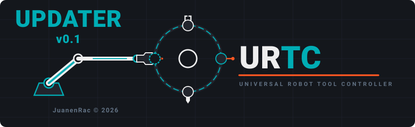

<p align="center">
  
</p>

# 🛠️ URTC-UPDATER

<p align="center"><a href="README.md">🇺🇸 English</a> | <a href="README_spa.md">🇪🇸 Español</a> | <a href="README_fra.md">🇫🇷 Français</a> | <a href="README_ita.md">🇮🇹 Italiano</a> | <a href="README_deu.md">🇩🇪 Deutsch</a> | 🇨🇳 <b>简体中文</b> | <a href="README_jpn.md">🇯🇵 日本語</a></p>

### 📦 检测、安装并手动更新整个 URTC 生态系统

<p align="center">
  
  
  
  
</p>

> **可视化桌面模式：** 默认桌面界面现通过可选的 `PySide6` GUI 运行时使用
> **Qt Quick / QML**。更新器核心与 `--cli` 模式仍仅使用标准库，适合无桌面的 CM5。
>
> **Windows 启动和操作证据：** 双击 `run-gui.vbs`（或不带参数运行
> `run.bat`）即可启动无控制台图形客户端。更新面板会显示真实的预检查、源更新、
> 清单验证、构建测试和完成检查点及捕获的证据；`run.bat --cli ...` 保留诊断终端。
> 仅在缺少检出时启用安装，仅在 GitHub 版本更高时启用更新。已批准操作期间，
> 检查点会替换项目控制区；选择其他项目即可恢复控制区。
> **安装全部缺失项目**和**更新全部过期项目**是分别确认的顺序批量操作，使用相同的
> 实时状态和安全流程。

**诚实核查 - 今天真正能运行的部分：** 整个生态系统的发现/版本逻辑（`registry.py`、`project_manifest.py`、`ecosystem_catalog.py`、`version_parse.py`、`detect.py`）、带重试/退避的真实 GitHub 原始内容客户端（`github_client.py`），以及安装/更新流水线中"克隆-暂存-验证-提升"的真实逻辑（`install.py`）都是真实且经过测试的——64 个通过的测试（`pytest tests/`），包括一个证明"目录损坏"与"单个项目清单损坏"相互隔离的模拟 HTTP 服务器，以及在临时目录中进行的真实 git 克隆/构建往返测试。`--cli status`/`install`/`update` 在你真正运行它们时，会端到端地驱动这同一套经过测试的核心逻辑，访问真实、在线的 GitHub 原始内容服务器（而非模拟）。Qt Quick 桌面 GUI（`qt_gui.py`、`qml/Main.qml`）和旧版 Tkinter 后备方案（`gui.py`）把同一套经过测试的核心接入一个真实窗口，并已经在真实的生态系统检出目录上运行过，但两者都没有自己的自动化测试——不存在 `test_gui.py`/`test_qt_gui.py`，因为这里没有尝试去驱动真实的 Qt/Tk 事件循环。`i18n.py` 的 7 语言覆盖由测试强制保证（`test_i18n.py`），但仅保证各语言间的键一致性，不保证翻译质量。具体已经交付了什么，请参见 `CHANGELOG.md`。

---

## 1. 🛠️ 技术概述

URTC-UPDATER 是一个小型工具——默认为窗口化 GUI，通过 `--cli` 可
获得完整的 CLI——旨在运行在真实的 CM5 本机上，或运行在开发者自己的
Windows/Linux/macOS 计算机上（任何以相同方式检出的工作区），它为生态
系统中通过每个相邻检出自身的 `urtc.project.json` 清单发现的
每一个其他真实项目都回答三个问题——这个数量本身在此从不写死，
因为它会随着生态系统一起增长：

1. **这里实际安装了什么，版本是多少？**
2. **GitHub 上发布的最新版本是什么？**
3. **如果 GitHub 上的版本更新，让我选择一个项目或已确认的顺序批量操作。**

最后一点是刻意为之、不容妥协的：本工具绝不会自行更改任何项目。对选定
项目的操作始终需要明确确认。GUI 还可以提供**安装全部缺失项目**或**更新
全部过期项目**；二者都是分别确认的顺序批量操作，并经过相同的清单、版本
和安全检查。不存在无人批准的夜间自动更新。

发现的项目中也并非每一个都属于 CM5 本机——大多数以 URTC 为前缀的仓库和
少数 HYDRA-UMC 仓库，是开发者从自己的 PC 上运行的工具（固件是从工作站
编译/刷写的，而非在单元本机上构建的），或是安装在手机/手表上的应用。
`registry.py` 自身的 `deploy` 字段记录了哪个属于哪种（见第 3 节），
GUI 的项目表格会据此进行筛选——当检测到运行在 Linux（真实 CM5 自身的
操作系统）上时默认为"仅 CM5"，在 Windows/macOS 上则默认为"显示全部"。

示例说明（下面的项目数量和每个版本号都是为了展示输出格式而虚构的，
并非真实捕获的执行结果——真实数量始终是 `registry.py` 当下实际发现的
数量，绝不是写死在本文档中的固定数字）：

```
$ urtc-updater --cli status
Workspace root: /home/pi/HYDRA-UMC
Checking GitHub... 59/59
PROJECT                        STACK       LOCAL     GITHUB    STATE
--------------------------------------------------------------------
HYDRA-UMC                      firmware-c  0.0.7     0.0.7     up to date
HYDRA-UMC-SERVER               node        0.0.5     0.0.9     OUTDATED
HYDRA-UMC-STUDIO               node        0.0.8     0.1.3     OUTDATED
...
59/59 installed, 2 outdated

$ urtc-updater --cli update HYDRA-UMC-SERVER
Updating HYDRA-UMC-SERVER into /home/pi/HYDRA-UMC ...
OK  Pulled latest into /home/pi/HYDRA-UMC/HYDRA-UMC-SERVER
OK  build.sh completed successfully.
```

不带任何参数运行 `urtc-updater`（或直接双击它）会在窗口中打开同样
的信息——一个可排序的项目表格、一个部署目标筛选器，以及针对当前所选行
的安装/更新按钮。

<p align="center">
  
</p>

## 2. 🔄 检查/更新实际是如何工作的

- **版本来源**：本生态系统自身的"里程表"式自动递增惯例（每次真实构建都会递增一个存在于源文件*内部*的版本号——根据项目所用技术栈的不同，可能是 `pyproject.toml`、`Cargo.toml`、`version.go`、`package.json`、`version.properties`、`pubspec.yaml`，或一个固件 `#define`）从未为该次递增创建过 git 标签或 GitHub Release。因此本工具直接通过 GitHub 的原始内容托管，读取每个项目自身的 `bump_version.py`/构建脚本已经在写入的那个*同一个*文件的仓库默认分支版本——而非 Releases API，后者会把每个项目都报告为"完全没有发布记录"。
- **本地检测**：对于每一个发现的项目，检查工作区根目录下是否存在一个与该项目名称完全一致的目录（标准的生态系统布局——每个项目作为同级目录，这正是 `build-frontend.sh`/HYDRA-UMC-SUITE 自身的发现逻辑已经假定的方式），如果存在，则读取该项目*自身*的本地版本文件副本。
- **单一解析实现**（`version_parse.py`）在本地读取和 GitHub 抓取之间共享，因此本地检出和 GitHub 抓取绝不会被两个独立漂移的正则表达式分别解读。
- **安装/更新**：`git clone`（安装）之后作为单独的一步再编译。更新一个已存在的检出则改为「通过验证实现原子性」：候选版本先被克隆、进行快进合并（绝不使用强制重置，因此真实的本地修改会明确失败，而非被丢弃），然后首先在一个完全独立的暂存克隆中编译/验证——只有当那次暂存编译真正成功时，实际安装才会被触碰（通过两次连续的目录重命名，之前的安装会被保留在 `<name>.backup` 中，而不是被删除）。在最终提升之前的任何时刻发生编译失败、检出分叉/存在未提交修改、崩溃或磁盘写满，都会让之前的安装完全不受影响、继续保持可运行——详见 `install.py` 自身 `clone_or_pull` 的 docstring。暂存克隆自身的 git 远程仓库会在创建后立即恢复为真实的 GitHub 上游（否则一个普通的本地克隆会指向旧的安装路径，一旦被提升就会在不知不觉中终止所有未来的更新），并且已安装检出自身真实的本地数据（任何 git 视为未跟踪或被忽略的内容——`data/settings.json` 及类似文件，不包括可重新生成的构建产物）会在编译前被带入暂存克隆，这样一个项目自身真实的运行状态就能在更新后保留下来，而不是被困在保留的 `.backup` 检出中。无论哪种情况，只要该项目自身实际拥有 `build-test.sh`/`build-test.bat`（不递增版本号的检查——见第 3 节），就会运行它。本工具从不重新实现某个项目自身的构建步骤。

<p align="center">
  
</p>

## 3. 🧱 架构与设计决策

- **默认 Qt Quick GUI，`--cli` 用于无桌面环境。** `main.py` 会在导入可选 PySide6
  运行时之前检查 `--cli`。CLI 可在没有显示器或桌面依赖的 CM5 上工作；无参数时会在
  可用条件下启动 QML，Tkinter 仅保留为临时兼容回退。
- **带窗口的 GUI 是真实的,支持 7 种语言的多语言(`i18n.py`)—— `--cli` 则刻意不支持。** 每个真实的控件都会根据保存的偏好或操作系统自身的区域设置,从语言 `Combobox`(en/es/fr/it/de/zh/ja,与公开仪表盘和每份 README 提供的相同 7 种语言)实时重新标注。项目/家族名称以及每个项目自身真实的 `notes`/`tech` 文本保持未翻译——`registry.py` 是它们唯一的真相来源,而 7 份并行的真实工程文档副本会破坏这一点。`--cli` 的输出刻意只保留英文:它是为脚本化/管道化设计的,在这种场景下,稳定、可 grep 的文本比本地化更重要。
- **`deploy` 是一种分类，而非一种限制。** 把每一个发现的项目都当作"属于 CM5 的东西"是错误的——固件仓库是从 PC 编译并刷写的（CM5 只需要通过 CAN-OTA 得到最终的二进制文件，从不需要本仓库自身的源代码），而若干工具（URTC-FLASHER、HYDRA-UMC-SUITE、HYDRA-UMC-TOOL-CLI……）本应运行在操作员自己的工作站上，而非单元本机内部。`registry.py` 的 `deploy` 字段（"cm5" / "user-pc" / "mobile" / "wearable" / "dev-server"）记录了这一点，GUI 的筛选器将其作为一个合理的起点使用——而非硬性限制，因为这个同一工具也可以运行在开发者自己的 PC 上，此时每一个发现的项目都可以被检查。
- **本工具中不包含针对特定技术栈的构建逻辑。** 本生态系统横跨 7 种工具链（Python、Rust、Go、Node/TS、Android/Kotlin、Flutter、ARM 固件）。在*这里*重新实现 `npm install && npm run build` / `cargo build --release` / `./gradlew assembleDebug` 等，会制造出第二个声称知道如何构建每个项目的地方，注定会与该项目自身真实的（且已经正确的）`build.sh`/`.bat` 逐渐脱节。`install.py` 转而探测一个已知的构建脚本名称（`build.sh`、`build_firmware.sh`、`build_exe.sh`、`build-android.sh` 及其 `.bat` 等效版本——这些是横跨生态系统自身发现的项目实际使用的真实名称），并运行其中实际存在的那一个。
- **使用 GitHub 原始内容，而非 Releases API。** 见上方第 2 节——本生态系统的版本控制惯例从不创建标签/发布，因此在这里使用 Releases API 不仅不够方便，而且是彻底错误的做法。
- **临时性网络故障会获得真正的重试；确定性的回应则永远不会。** 每一次真实的 GitHub 请求（`github_client.py` 的 `_urlopen_with_retries`）最多重试 3 次并带有退避延迟，但仅限于连接从未获得任何响应的情况（DNS/超时/重置）。GitHub 实际返回的真实 HTTP 状态——404、403、500——永远不会被重试：GitHub 已经给出了答复，再次请求只会消耗更多的速率限制额度而得到相同的结果。
- **格式错误的远程目录会响亮地失败；单个格式错误的项目不会。** 如果 GitHub 的仓库列表本身无法访问或无法解析，`discover_remote_projects()` 会抛出异常——`gui.py` 和 `main.py` 都已经捕获了这一点，并回退到本地发现的项目列表，而不是显示一次损坏或空白的扫描。相反，单个仓库格式错误的清单会被隔离到该次扫描自己的 `errors` 列表中，绝不会中止对其余项目的发现——一个真实的、基于夹具服务器的测试（`tests/test_github_client.py`）证明了这两条路径。
- **CLI 操作保持明确；GUI 批量操作保持确认。** CLI 的 `install`/`update`
  命令需要一个项目名称。桌面 GUI 可以执行**安装全部缺失项目**或**更新全部
  过期项目**，但只会在独立确认后，并按顺序通过相同安全检查执行。不存在
  无人值守的自动更新。
- **仅使用标准库。** `urllib` 用于 GitHub 抓取（`github_client.py`），`subprocess` 用于 git/构建脚本调用（`install.py`），仅此而已——一个负责维护其他*所有*项目依赖健全性的工具，其自身保持零依赖，这是刻意为之的。
- **已知的简化处理**：HYDRA-UMC 和 URTC 是真正的多组件固件仓库（各自分别有 6 个和 4 个独立版本管理的二进制文件——见各自的 `VERSION_CHECKLIST.txt`/`build_firmware.sh`），并不存在单一的"那个"版本号。`registry.py` 每个仓库只跟踪*一个*代表性组件——足以回答"这个仓库大致是否是最新的"，但不能替代 `build_firmware.sh` 自身的 `firmware_manifest.json` 用于真实的刷写场景。

## 📂 目录结构

```
URTC-UPDATER/
├── src/urtc_updater/
│   ├── registry.py         # ProjectEntry —— 没有静态目录;在发现时从每个仓库自身的清单构建
│   ├── project_manifest.py # 读取/校验仓库自身的 urtc.project.json
│   ├── ecosystem_catalog.py # JuanenRac 生态系统公开发现目录的解析器
│   ├── version_parse.py   # 单一的正则表达式提取实现，本地+GitHub 通用
│   ├── detect.py          # 扫描工作区根目录，检测已安装的内容
│   ├── github_client.py   # 并发抓取原始内容 + 针对临时性网络错误的真实重试/退避机制
│   ├── install.py         # git clone/pull + 委托给项目自身的构建脚本
│   ├── i18n.py             # 真实、完整的 GUI 翻译（7 种语言）
│   ├── qt_gui.py           # 通向真实发现/更新服务的 Qt Quick 桥接层
│   ├── qml/Main.qml        # 带主题、检查点和 About 的桌面界面
│   ├── gui.py              # PySide6 不可用时的 Tkinter 兼容回退
│   └── main.py             # 分发逻辑：默认 GUI，--cli 用于 status/install/update
├── tests/                  # 真实测试：github_client、i18n、install、project_manifest、registry
├── docs/
│   ├── CLI_REFERENCE.md     # 命令参考
│   └── QML_DESKTOP_GUI.md   # Qt Quick GUI 架构
├── images/                 # 媒体、应用图标与界面截图
├── tools/
│   ├── build_test.py        # 不递增版本号的构建检查
│   ├── ci_validate.py       # CI 使用的清单/CHANGELOG/文档校验
│   ├── generate_app_icon.py # 将公开的 HYDRA-UMC SVG 渲染为 Windows 使用的图标
│   ├── migrate_project_manifests.py  # 一次性清单迁移后对工作区的审计
│   └── validate_project_manifests.py # 校验仓库自身的清单 + 原生构建版本号
├── .env.example            # 环境变量模板
├── build.sh / build.bat    # venv + 可编辑安装 + 编译检查
├── run.sh / run.bat        # 默认 GUI / CLI 入口
├── run-gui.vbs             # 无控制台窗口的 Windows 图形启动器
├── bump_version.py         # 生态系统统一的里程表式版本递增（pyproject.toml + __init__.py）
└── bump_manifest_version.py # 将 urtc.project.json 的版本与原生版本同步(--sync)
```

## ⚙️ 构建与运行

```bash
chmod +x build.sh   # 仅需一次
./build.sh          # 创建 .venv，pip install -e .，对一切进行编译检查
./run.sh                              # 窗口化 GUI（默认）
./run.sh --cli status                 # 已安装的内容，本地版本与 GitHub 版本对比
./run.sh --cli status --offline       # 相同，但跳过 GitHub 检查
./run.sh --cli install <PROJECT-NAME> # 克隆 + 构建一个尚未安装的项目
./run.sh --cli update  <PROJECT-NAME> # 拉取 + 重新构建一个已安装的项目
```

在 Windows 上：先 `build.bat`，然后 `run.bat`（GUI）/ `run.bat --cli
status` / `run.bat --cli install <name>` / `run.bat --cli update
<name>`。

首选 GUI 需要可选 Qt 运行时（`pip install -e ".[gui]"`；
`build.bat`/`build.sh` 已经安装它）。`--cli` 没有图形依赖，适合无桌面的
CM5。没有 Qt 时，旧 Tkinter 窗口仅作为兼容回退。

**故障排查**

- `status` 对某个项目的本地或 GitHub 版本显示 `?`：其版本文件存在，但该项目自身的惯例自 `registry.py` 上次更新以来发生了变化——请对照该项目真实的、当前的版本文件，检查 `registry.py` 中对应的条目。
- `status` 对 GitHub 显示 `-` 但没有显示任何错误：运行 `status`（不带 `--offline`）——`-` 只会在 GitHub 检查被完全跳过时出现。
- `install`/`update` 失败并提示"未找到 build.sh/.bat"：该项目使用了本工具尚未识别的构建脚本名称——请查阅其自身的 README 以获取真实名称，并考虑将其添加到 `install.py` 自身的 `BUILD_SCRIPT_CANDIDATES_*` 列表中。
- `git pull --ff-only` 失败：本地检出存在未提交的修改，或历史已分叉——请手动解决该问题（在该项目自身的目录中运行 `git status`）后再重试 `update`。本工具从不对检出进行强制重置。

## 🚀 路线图

- 一个打包的独立 GUI 可执行文件（PyInstaller，与 HYDRA-UMC-SUITE 自身的 `build_exe.bat`/`.sh` 惯例一致），实现完全无需 `pip`/venv 步骤的双击安装——目前的 GUI 仍然需要像 CLI 一样先执行 `./build.sh`。
- 可选的逐项目依赖预检查（在 `install` 中途失败之前，报告缺失的工具链——未安装 Rust/Go/Android SDK/Flutter）。
- 为 `status` 提供 `--json` 输出模式，便于对其进行脚本化调用。
- 针对 HYDRA-UMC/URTC 自身多二进制固件的逐组件跟踪（见第 3 节中的"已知的简化处理"），一旦出现超出目前所跟踪的单一代表性组件的真实需求。

## 🔗 相关项目

**URTC**(通用机器人工具控制器)是同一作者(JuanenRac / Electro Hobby 3D)打造的真实物理换刀平台。每个仓库都有自己的版本、自己的测试和自己的 README;这是完整的项目家族:

* **[URTC](https://github.com/JuanenRac/URTC)** - 物理通用机器人工具控制器 PCB 的固件,基于 CAN 总线的 25+ 工具配置
* **[URTC-FLASHER](https://github.com/JuanenRac/URTC-FLASHER)** - URTC 板卡的桌面刷写工具,CAN-OTA 加完整芯片 SWD/JTAG
* **[URTC-SMART-RACK](https://github.com/JuanenRac/URTC-SMART-RACK)** - 工具挂架固件,具备真实的工具 ID 解码和 Smart Idle 预热逻辑
* **[URTC-TESTER](https://github.com/JuanenRac/URTC-TESTER)** - URTC 板卡的桌面实时 CAN 总线诊断工具,每个工具配置一个面板
* **[URTC-VISION-TOOL](https://github.com/JuanenRac/URTC-VISION-TOOL)** - 固件加真实的 Python 视觉配套程序,用于热成像/RGB 检测工具头
* **[URTC-WEB-STUDIO](https://github.com/JuanenRac/URTC-WEB-STUDIO)** - 通过 Web Serial API 实现的 URTC-TESTER 浏览器替代方案,无需本地安装
* **URTC-UPDATER**(本仓库)- 检测、安装并更新生态系统自身的仓库

本工具的设计(清单发现、以验证为准的原子安装/更新、证据日志)与同一作者为 HYDRA-UMC 和 A.R.M.O.R. 生态系统打造的 **[HYDRA-UMC-UPDATER](https://github.com/JuanenRac/HYDRA-UMC-UPDATER)** 和 **[ARMOR-UPDATER](https://github.com/JuanenRac/ARMOR-UPDATER)** 共享,二者各自仅限于自己的仓库。

## 📚 文档与社区

* **[docs/CLI_REFERENCE.md](docs/CLI_REFERENCE.md)** — 每一个 `--cli` 子命令、从真实安装环境中获取的真实输出,以及退出码契约。
* **[docs/QML_DESKTOP_GUI.md](docs/QML_DESKTOP_GUI.md)** — Qt Quick/QML 桌面客户端的真实结构,以及它为何始终是同一个后端之上的真实控制界面(与 `--cli` 共用后端),而不是第二套实现。
* **[本仓库的更新日志](CHANGELOG.md)**
* 问题、想法与报告:electrohobby3d@gmail.com

## 👤 作者
**JuanenRac** (Electro Hobby 3D)
📧 electrohobby3d@gmail.com
📺 [youtube.com/@electrohobby3d](https://youtube.com/@electrohobby3d)

## 📜 许可证

GPL-3.0-or-later —— 详见 [LICENSE](LICENSE)。
